# Image-Processing Final Project — Robustness of Vision Models to Distortions

**Goal:** evaluate how robust image-processing / computer-vision algorithms and models are to
controlled image distortions, and how much we can recover with (1) image restoration and
(2) model fine-tuning.

This README is the report — design decisions and references, the experiment setup, and all the
result tables, before/after grids, and degradation/recovery curves are here. Everything was run on
a MacBook (Apple MPS); a free Colab T4 reproduces it.

---

## Abstract

We measure how three common image degradations — **Gaussian noise, blur, and JPEG compression** —
affect vision algorithms at two levels of abstraction: **low-level feature detection** (SIFT
keypoints) and **high-level scene understanding** (breed classification with ResNet-50, semantic
segmentation with DeepLabV3). Using the Oxford-IIIT Pet dataset, we sweep each distortion over
multiple intensities (quantified as SNR) and, for every condition, compare two recovery
strategies: **classical pre-processing** (NLM denoising, unsharp deblurring, bilateral
de-blocking) and **fine-tuning** the deep models on distorted data. The central question is
whether cleaning the *image* or adapting the *model* recovers more task performance — and our
results show the answer depends strongly on the task's level of abstraction.

## Introduction

Real imaging pipelines rarely receive clean input: sensor noise, defocus/motion blur, and lossy
compression all corrupt an image before any algorithm sees it. Knowing **which methods are robust**
— and whether a cheap restoration step actually helps — matters for building reliable systems.

We follow a controlled design: start from clean ground-truth imagery, apply parametric
distortions, then evaluate three recovery strategies against the clean baseline:

1. **None** — run the model / detector directly on the degraded image.
2. **Restoration** — apply a distortion-specific classical cleaner, then run the frozen model.
3. **Fine-tuning** — adapt the deep model to the distortion domain (DL tasks only).

Mixing a low-level classical task (SIFT, no training, no labels) with two high-level deep tasks
lets us contrast how degradation and recovery behave across the abstraction spectrum. We went in
expecting the matched cleaners to help; the most interesting part of the project turned out to be
the cases where they don't.

---

## 1. Decision table (the chosen end-to-end bundle)

| Axis | Choice | One-line justification |
|---|---|---|
| **Dataset** | [Oxford-IIIT Pet](https://www.robots.ox.ac.uk/~vgg/data/pets/) ([torchvision loader](https://pytorch.org/vision/stable/generated/torchvision.datasets.OxfordIIITPet.html)) | One small dataset with GT for **both** classification (breed label) and segmentation (trimap mask); also ships head bounding boxes; Colab-friendly. |
| **Task 1 — high-level, DL** | classification → [ResNet-50](https://arxiv.org/abs/1512.03385) ([torchvision](https://pytorch.org/vision/stable/models/resnet.html)) | Strong pretrained backbone; fine-tune to 37 breeds; metric = **Top-1 accuracy**. |
| **Task 2 — high-level, DL, dense** | segmentation → [DeepLabV3-ResNet50](https://arxiv.org/abs/1706.05587) ([torchvision](https://pytorch.org/vision/stable/models/deeplabv3.html)) | Pretrained dense model; fine-tune pet-vs-background; metric = **mIoU**. |
| **Task 3 — low-level, classical** | interest points → [SIFT](https://www.cs.ubc.ca/~lowe/papers/ijcv04.pdf) ([OpenCV](https://docs.opencv.org/4.x/da/df5/tutorial_py_sift_intro.html)) | No GT needed, CPU-only; metrics = **repeatability rate** + **matching score**. |
| **Distortion 1** | [Gaussian noise](https://en.wikipedia.org/wiki/Gaussian_noise) | Intensity axis = σ; attacks fine texture → SIFT + classifier. |
| **Distortion 2** | [Gaussian blur](https://docs.opencv.org/4.x/d4/d13/tutorial_py_filtering.html) | Intensity = kernel σ; removes high-frequency detail. |
| **Distortion 3** | [JPEG compression](https://ieeexplore.ieee.org/document/125072) | Intensity = quality factor; blocky 8×8 DCT artifacts. |
| **Metrics axes** | per **class** AND per **intensity (SNR)** | Required two-axis reporting; plus before/after grids and curves. |


---

## 2. Methods & matched enhancements (with references)

Matching rule: each distortion is paired with the cleaner designed to invert it.

| Distortion | Matched enhancement (default = classical) | Reference |
|---|---|---|
| Gaussian noise | **Denoising** — Non-Local Means (`cv2.fastNlMeansDenoisingColored`) | [Buades et al. 2005 / IPOL](https://www.ipol.im/pub/art/2011/bcm_nlm/) |
| Blur | **Deblurring** — unsharp masking (Wiener / DL optional) | [Unsharp masking](https://en.wikipedia.org/wiki/Unsharp_masking) |
| JPEG | **Artifact removal** — bilateral filter (DL optional) | [Tomasi & Manduchi 1998](https://users.cs.duke.edu/~tomasi/papers/tomasi/tomasiIccv98.pdf) |

**Improvement per DL task:** (1) restoration pre-processing, (2) fine-tuning on distorted data.
SIFT gets restoration only — it is a fixed algorithm with no weights to train.

### 2.1 Degradation model

**Gaussian noise.** Independent zero-mean noise is added to every pixel:

$$I'(x) = I(x) + n,\qquad n \sim \mathcal{N}(0,\sigma^2)$$

Levels: $\sigma \in \{5,10,20,40,80\}$ (0–255 scale) → SNR 28→6 dB. *Visual effect:* fine grain
that buries texture and edges. *Matched restoration:* NLM denoising (§2.2).

**Blur.** Convolution with a Gaussian kernel of width $\sigma$:

$$I' = I * G_\sigma,\qquad G_\sigma(u,v)=\tfrac{1}{2\pi\sigma^2}e^{-(u^2+v^2)/2\sigma^2}$$

Levels: $\sigma \in \{0.5,1,2,4,8\}$ → SNR 32→16 dB. *Visual effect:* loss of high-frequency
detail; defocus-like softening. *Matched restoration:* unsharp deblurring (§2.2).

**JPEG.** Each 8×8 block is DCT-transformed and quantized at quality factor $Q$, then decoded.
Levels: $Q \in \{90,70,50,30,10\}$ → SNR 33→21 dB. *Visual effect:* blocking on 8×8 seams and
ringing near edges. *Matched restoration:* bilateral de-blocking (§2.2).

### 2.2 Restoration methods (why it helps · trade-off)

- **NLM denoising** (noise) — replaces each pixel by a weighted average of pixels with *similar
  patches*. *Why it helps:* exploits natural self-similarity to cancel zero-mean noise.
  *Trade-off:* smooths fine texture, which is exactly what SIFT and the classifier rely on.
- **Unsharp deblurring** (blur) — adds back a scaled high-pass: $I_\text{sharp}=I+a\,(I-G*I)$.
  *Why it helps:* re-boosts the high frequencies blur attenuated. *Trade-off:* amplifies noise and
  cannot recover frequencies fully removed.
- **Bilateral de-blocking** (JPEG) — edge-aware smoothing that averages only spatially *and*
  photometrically close pixels. *Why it helps:* softens block seams in flat regions while keeping
  true edges. *Trade-off:* cannot restore discarded DCT coefficients.

### 2.3 Models
- **ResNet-50:** deep residual CNN; skip connections let very deep nets train stably.
- **DeepLabV3:** atrous (dilated) convolutions + ASPP to segment at multiple scales.
- **SIFT:** scale-space DoG keypoints with gradient-orientation descriptors invariant to scale/rotation.

---

## 3. Dataset & EDA

Oxford-IIIT Pet, `trainval` split, downloaded via torchvision (`python -c "from src.data.pets import load_pets_classification; load_pets_classification(download=True)"`).

| Property | Value |
|---|---|
| Images (trainval) | 3,680 |
| Breeds (classes) | 37 (cats + dogs) |
| Images per class | min 93 · max 100 · mean 99.5 (well balanced) |
| Image size (sampled) | width 140–650 (median 500) · height 134–566 (median 375) |
| Ground truth | breed label · head bounding box · trimap segmentation mask |

**Annotated samples** (breed title · green head bbox · red pet mask overlay) — generated by
`scripts/eda.py`:


**Class distribution** (37 breeds, near-uniform ~100 images each):


> Note: Oxford-IIIT Pet bounding boxes annotate the **head** only, so the green box is small
> relative to the full animal that the segmentation mask covers.

---

## 4. Experiment design & metrics

For every (task × distortion) we evaluate four conditions against the clean baseline:

1. **Baseline** — clean images (upper bound).
2. **Distorted** — full intensity sweep.
3. **Restoration** — distorted → matched cleaner → frozen model.
4. **Fine-tune** — DL model re-trained on distortion-augmented data (DL tasks only).

We define **recovery** as the gain a strategy buys back: 

$$
\Delta = \text{metric}_{\text{recovered}} - \text{metric}_{\text{distorted}}
$$

(positive = helps, negative = hurts). Results are reported **per class** and **per intensity (SNR)**.

### Experimental sample

| Task | Model | Eval set | Metric | GT requirement |
|---|---|---|---|---|
| Feature detection | SIFT | 40 seeded dataset images, full sweep | repeatability, matching ratio (mean ± std) | none |
| Classification | ResNet-50 | 300 val images (aggregate) · 2,480 held-out images (per breed) | Top-1 (overall + per breed × intensity) | breed label |
| Segmentation | DeepLabV3 | 300 val images | mIoU + per-class IoU (pet / background) | trimap mask |

Subsets use a fixed seed (42) for reproducibility. The per-breed × intensity sweep
(`scripts/run_classification_per_class.py`) evaluates on every trainval image outside the
1,200-image training subset (~67 per breed), because ranking 37 breeds from the 300-image
val subset (~8 per breed) would be dominated by binomial noise.

### Metric definitions

- **Top-1 accuracy:** $\frac{1}{N}\sum_i \mathbb{1}[\hat{y}_i = y_i]$.
- **mIoU:** mean over classes of $\mathrm{IoU}=\dfrac{|P\cap G|}{|P\cup G|}$ (prediction $P$, ground truth $G$).
- **Repeatability:** fraction of clean keypoints with a distorted keypoint within $\tau=3$ px
  (distortions are non-geometric, so the correspondence is the identity).
- **Matching ratio:** Lowe-ratio-passing matches / clean keypoints.
- **SNR** (quantifies each distortion level in dB): $10\log_{10}\!\dfrac{\overline{I_\text{clean}^2}}{\mathrm{MSE}}$ — signal power over distortion power. **PSNR** $= 10\log_{10}\!\dfrac{255^2}{\mathrm{MSE}}$ is reported alongside; the two differ only by the per-image energy offset $10\log_{10}(\overline{I^2}/255^2)$, so SNR is a monotone re-scaling of the same fidelity axis.

Outputs: result tables (per class + per intensity), degradation/recovery **curves**, and
**before/after** image grids.

---

## 5. Compute & GPU flags

- **CPU (local):** SIFT, all distortions/enhancements, EDA, baseline inference.
- **GPU:** the two fine-tunes (ResNet-50, DeepLabV3). Confirmed to run locally on **Apple MPS**;
  free **Colab T4** is the documented fallback (`notebooks/colab_finetune.ipynb`, runtime → T4).

---

## 6. Repository structure

```
.
├── configs/            # experiment config (paths, intensity sweeps, subset sizes)
├── src/
│   ├── data/           # Oxford-IIIT Pet loaders + distortion-injecting datasets
│   ├── distortions/    # gaussian noise / blur / jpeg + intensity sweeps
│   ├── enhancements/   # denoise / deblur / de-jpeg (classical + optional DL)
│   ├── tasks/          # classification (ResNet-50), segmentation (DeepLabV3), keypoints (SIFT)
│   ├── metrics/        # top-1, mIoU, repeatability, matching score
│   └── utils/          # viz (grids/curves), picklable image-op
├── scripts/            # eda.py + run_{keypoints,classification,segmentation}[_finetune].py
│                       #   + run_classification_per_class.py + run_noise_fairness.py
│                       #   + validate_noise_estimator.py + make_figures.py + smoke_test.py
├── notebooks/          # Colab fine-tuning
├── assets/             # README figures (tracked)
└── results/            # generated tables / figures (git-ignored)
```

---

## 7. Setup

```bash
python -m venv .venv && source .venv/bin/activate
pip install -r requirements.txt
python scripts/smoke_test.py          # sanity check (no GPU/data needed)
python scripts/eda.py                 # dataset stats + annotated grid
python scripts/run_keypoints.py       # Task 3 (CPU)
python scripts/run_classification.py  # Task 1 (MPS/GPU)
python scripts/run_segmentation.py    # Task 2 (MPS/GPU)

# Improvement #2 (fine-tune on distorted data) + the per-class x intensity sweep:
python scripts/run_classification_finetune.py
python scripts/run_segmentation_finetune.py
python scripts/run_classification_per_class.py  # per-breed heatmaps (needs the Task 1 checkpoint)

# Noise-fairness experiment (blind self-calibrating restoration + fine-tune probes):
python scripts/validate_noise_estimator.py      # validate the sigma estimator first (CPU)
python scripts/run_noise_fairness.py            # three restoration arms + probes (needs checkpoints)

python scripts/make_figures.py                  # regenerate all CPU report figures in one command
```

---

## 8. Progress vs. course weekly plan

| Week | Deliverable | Status |
|---|---|---|
| 1 | Open Git repo + register | ✔ repo · *register in course table (manual)* |
| 2 | Dataset/distortions/tasks table with links | ✔ §1 |
| 3 | Methods/enhancements table with links | ✔ §2 |
| 4 | Download + EDA + annotated grid | ✔ §3, `scripts/eda.py` |
| 5–6 | Run on clean data + measure (per class) | ✔ all 3 tasks (cls 0.93, seg 0.92, SIFT) |
| 7 | Apply distortions + before/after | ✔ `src/distortions`, grids |
| 8 | Measure degradation | ✔ all 3 tasks |
| 9 | Apply enhancements + measure | ✔ all 3 tasks |
| 10–11 | Fine-tune + measure | ✔ classification + segmentation (improvement #2) |
| 12 | Polish README (de-AI pass) | ✔ voice + docstring pass |
| 13 | PPT/PDF + final repo review | ◻ (slide draft in `docs/SLIDES.md`) |

---

## 9. Results

### Distortions + matched restoration (qualitative)

Generated by `scripts/make_distortion_grids.py`:

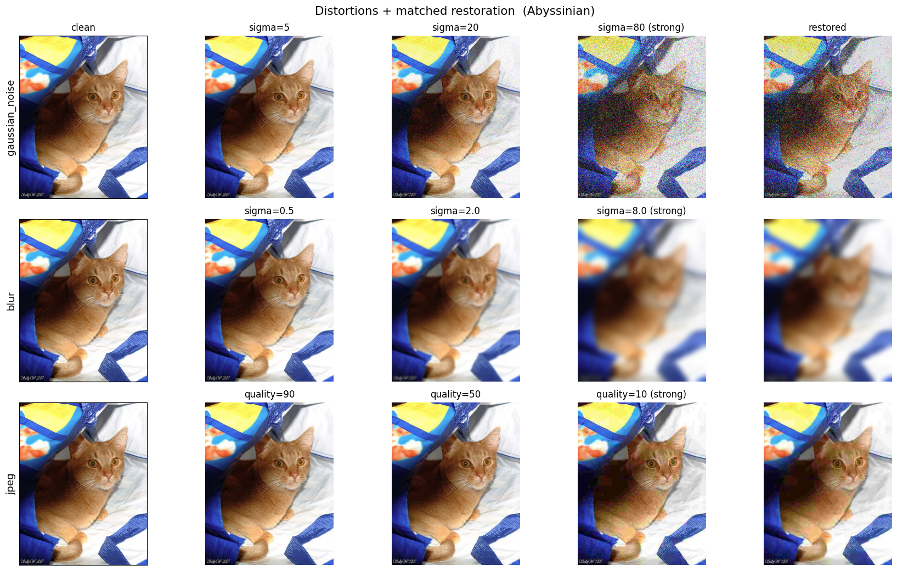

### Distortion intensity → measured SNR

Each intensity knob maps to a physical SNR (mean over 40 images, `scripts/snr_table.py`),
so the "per-SNR" sweep has a dB interpretation. PSNR is shown alongside for reference — it is a
constant per-image offset above SNR (here ≈ +6.1 dB), so it orders the levels identically:

| Distortion | weak → strong (knob) | SNR (dB) | PSNR (dB) |
|---|---|---|---|
| noise (σ) | 5 → 80 | 28.1 → 5.6 | 34.2 → 11.7 |
| blur (σ) | 0.5 → 8 | 32.5 → 15.6 | 38.6 → 21.7 |
| jpeg (q) | 90 → 10 | 33.0 → 20.8 | 39.2 → 26.9 |

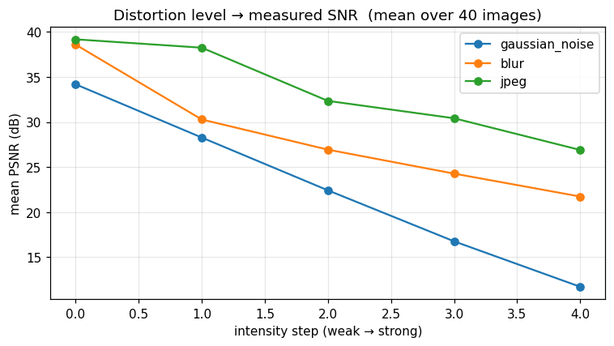

### Task 1 — ResNet-50 classification (high-level, DL)

Baseline (clean) Top-1 = **0.933** on 300 held-out val images (fine-tuned 5 epochs on 1,200
clean images, Apple MPS).

Top-1 accuracy under each strategy (distorted vs. restored vs. fine-tuned on distorted data):

| Distortion | level | distorted | restored | fine-tuned |
|---|---|---|---|---|
| noise (σ) | 5 | 0.93 | 0.70 | 0.90 |
| noise (σ) | 20 | 0.86 | 0.72 | 0.90 |
| noise (σ) | 80 | 0.22 | 0.24 | **0.75** |
| blur (σ) | 1.0 | 0.90 | 0.87 | 0.90 |
| blur (σ) | 4.0 | 0.44 | 0.50 | **0.79** |
| jpeg (q) | 50 | 0.90 | 0.87 | 0.91 |
| jpeg (q) | 10 | 0.64 | 0.64 | **0.82** |

<p>
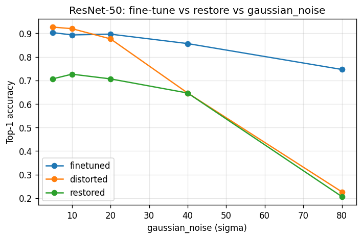
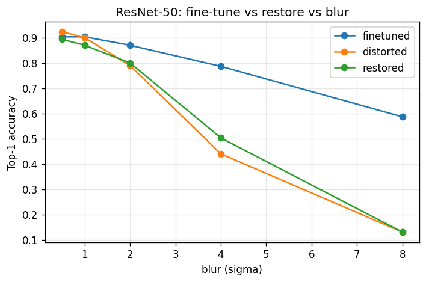
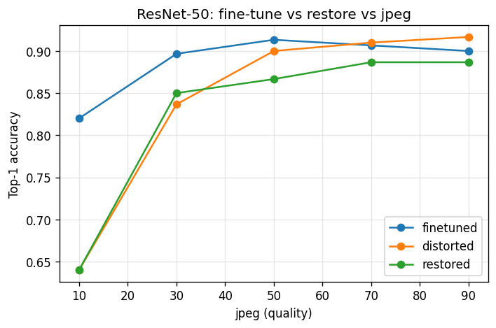
</p>

*Top-1 vs. intensity for noise / blur / JPEG: distorted, restored, and fine-tuned.*

**Findings:**

1. ResNet-50 is **robust to mild distortion** — accuracy barely moves for noise $\sigma \leq 20$, blur $\sigma \leq 1$, or JPEG $q \geq 50$, and collapses only at strong levels.

2. Blind classical restoration **mostly hurts**: NLM denoising drops $\sigma=5$ accuracy 0.93 $\rightarrow$ 0.70, and de-JPEG gives nothing back; only deblurring helps, and only at strong blur.

3. **Fine-tuning is decisively the best recovery**: at the worst levels it recovers what restoration cannot — noise $\sigma=80$ **0.22 $\rightarrow$ 0.75**, blur $\sigma=8$ 0.13 $\rightarrow$ 0.59, JPEG $q=10$ 0.64 $\rightarrow$ 0.82.

**Per-breed × intensity (the two reporting axes crossed).** Per-breed numbers come from the
2,480 held-out images (~67/breed, `scripts/run_classification_per_class.py`) — clean overall
Top-1 there is 0.911. Worst breeds on clean data: Egyptian Mau 0.72, American Pit Bull
Terrier 0.74, Staffordshire Bull Terrier 0.74, Birman 0.79; three breeds sit at 1.00. The
weak breeds are exactly the lookalike pairs (Pit Bull ↔ Staffordshire Bull Terrier,
Birman ↔ Ragdoll, Egyptian Mau ↔ Bengal).

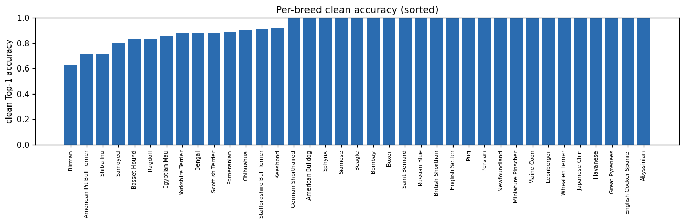

Crossing breed with distortion intensity (rows sorted by clean accuracy, best on top):

<p>
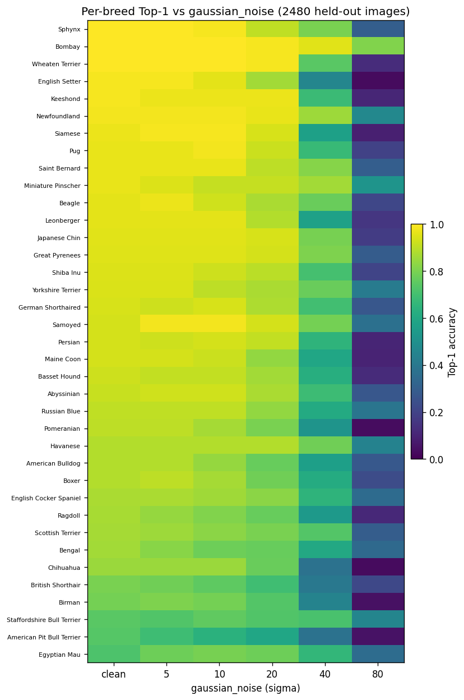
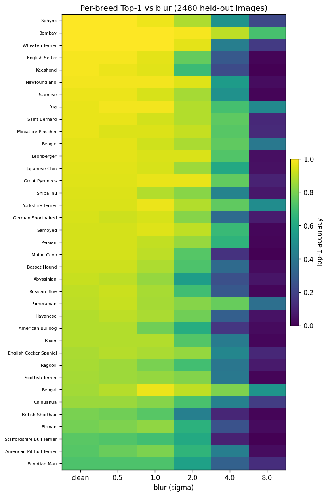
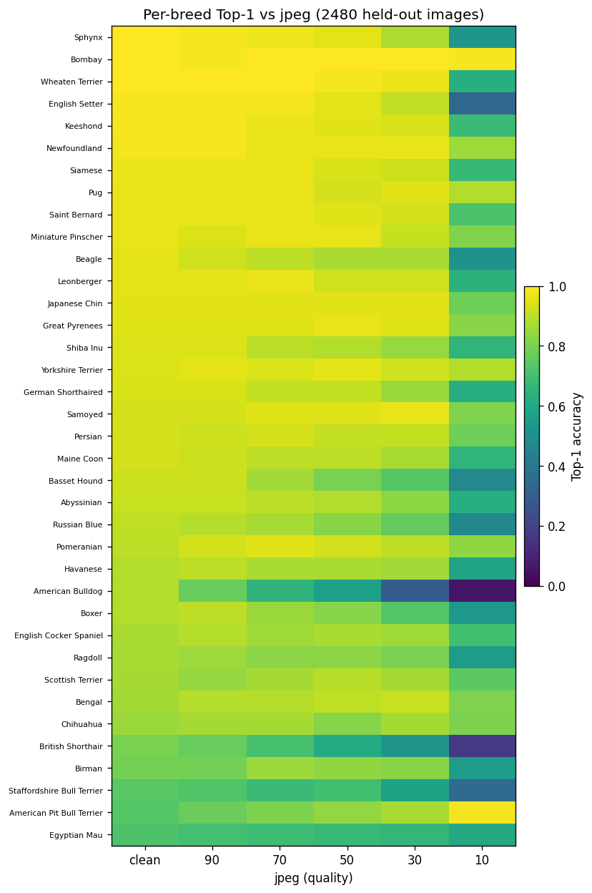
</p>

*Per-breed Top-1 vs intensity for noise / blur / JPEG.*

Two patterns: **moderate distortion amplifies existing confusions** — at blur σ=4 the five
weakest-on-clean breeds average 0.24 while the five strongest still hold 0.47, and at JPEG q=10
it's 0.53 vs 0.63 — whereas **extreme noise flattens everyone** (σ=80: 0.22 vs 0.27; the
degradation stops being class-selective once texture is gone). A side lesson in sample size:
the earlier 300-image val subset (~8/breed) ranked Birman worst at 0.62; with ~67/breed its
true accuracy is 0.79 and Egyptian Mau is the real laggard.

### Task 2 — DeepLabV3 segmentation (high-level, DL)

Baseline (clean) mIoU = **0.923** on 300 val images (fine-tuned 5 epochs on 1,200 clean images).

| Distortion | level | distorted | restored | fine-tuned |
|---|---|---|---|---|
| noise (σ) | 5 | 0.922 | 0.901 | 0.912 |
| noise (σ) | 20 | 0.904 | 0.899 | 0.908 |
| noise (σ) | 80 | 0.623 | 0.620 | **0.870** |
| blur (σ) | 1.0 | 0.916 | 0.921 | 0.910 |
| blur (σ) | 8.0 | 0.791 | 0.799 | **0.833** |
| jpeg (q) | 50 | 0.922 | 0.918 | 0.912 |
| jpeg (q) | 10 | 0.847 | 0.873 | **0.891** |

<p>
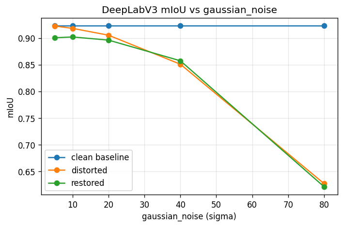
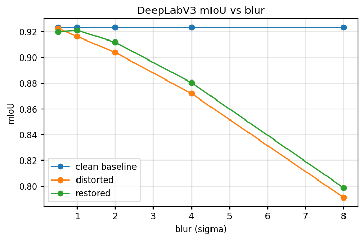
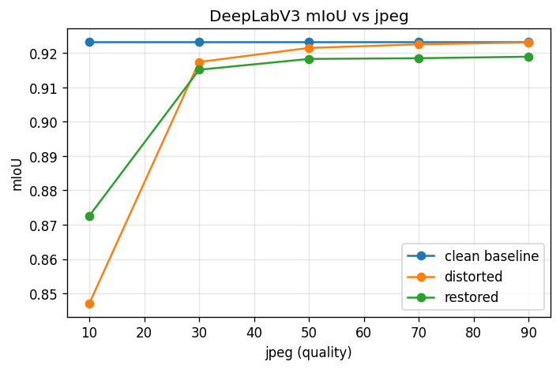
</p>

*mIoU vs. intensity for noise / blur / JPEG; clean baseline, distorted, and restored.*

**Findings.** Segmentation is the **most robust** task: mIoU holds ≥0.85 until the strongest
levels and only noise σ=80 causes a large drop (0.923→0.623). Restoration is **roughly neutral**
(small help at strong blur/JPEG, small harm at mild noise). **Fine-tuning again wins where it
matters most** — noise σ=80 0.623→**0.870**, blur σ=8 0.791→0.833, JPEG q=10 0.847→0.891.

**Per-class IoU (the second reporting axis).** Splitting mIoU into its two classes shows the
degradation is not symmetric — it concentrates almost entirely in the **pet** class:

| Condition | IoU background | IoU pet | gap |
|---|---|---|---|
| clean | 0.935 | 0.911 | 0.02 |
| noise σ=80, frozen model | 0.731 | **0.515** | **0.22** |
| noise σ=80, fine-tuned | 0.890 | 0.850 | 0.04 |

The background is large, smooth regions that survive noise; the pet is the textured object whose
boundary evidence the noise destroys, so the aggregate mIoU understates how badly the actual
object mask degrades. Fine-tuning doesn't just recover the mean — it closes the per-class gap
(0.22 → 0.04). Full per-class curves for all three distortions (distorted and restored):

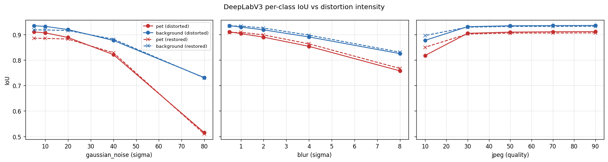

### Task 3 — SIFT keypoints (low-level, classical)

Repeatability and matching score vs. distortion intensity, before and after the matched
cleaner, measured per image against its own clean version and averaged over **40 seeded
dataset images** (mean ± std) — the same sample the SNR calibration uses, so both axes
describe identical data. Baseline (clean vs. clean) repeatability = 1.00; mean 714 SIFT
keypoints per clean image (min 170, max 2,026).

| Distortion | level | repeatability (distorted → restored) | Δ recovery | matching (distorted → restored) |
|---|---|---|---|---|
| noise (σ) | 5 | 0.77±0.04 → 0.42±0.10 | **−0.35** | 0.75 → 0.41 |
| noise (σ) | 20 | 0.53±0.05 → 0.41±0.07 | −0.11 | 0.43 → 0.35 |
| noise (σ) | 80 | 0.24±0.04 → 0.24±0.04 | 0.00 | 0.12 → 0.12 |
| blur (σ) | 0.5 | 0.77±0.03 → **0.78±0.04** | +0.01 | 0.76 → 0.64 |
| blur (σ) | 1.0 | 0.45±0.06 → **0.76±0.03** | **+0.31** | 0.40 → **0.67** |
| blur (σ) | 8.0 | 0.02±0.01 → 0.02±0.01 | +0.00 | 0.04 → 0.05 |
| jpeg (q) | 90 | 0.86±0.05 → 0.54±0.06 | −0.32 | 0.86 → 0.53 |
| jpeg (q) | 10 | 0.54±0.03 → 0.45±0.05 | −0.10 | 0.37 → 0.34 |

*Repeatability uses one-to-one keypoint matching (τ = 3 px); mean ± std over 40 seeded
Oxford-IIIT Pet images. The stds are small relative to the effects — every headline gap
(denoise −0.35, deblur +0.31, de-JPEG −0.32) is several standard deviations wide.*

<p>
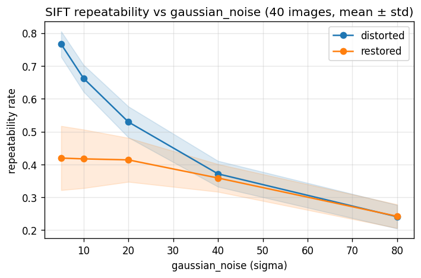
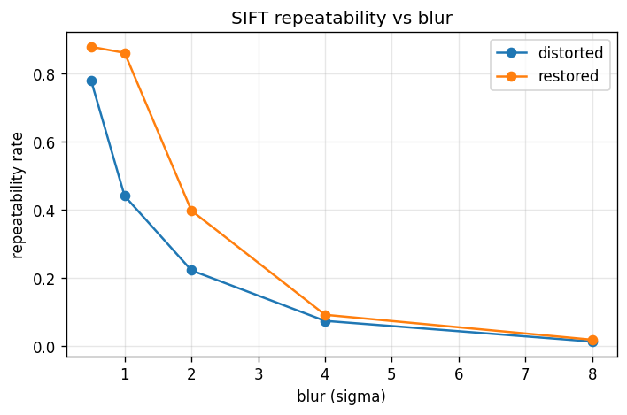
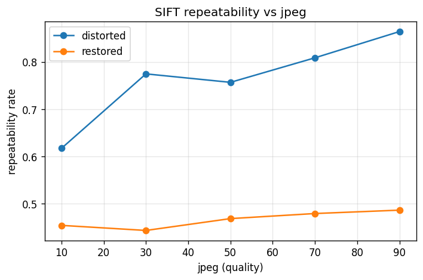
</p>

*Repeatability vs. intensity for noise / blur / JPEG; distorted vs. restored, shaded band = ±1 std.*

<p>
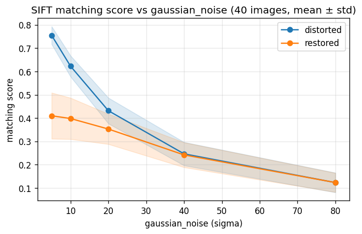
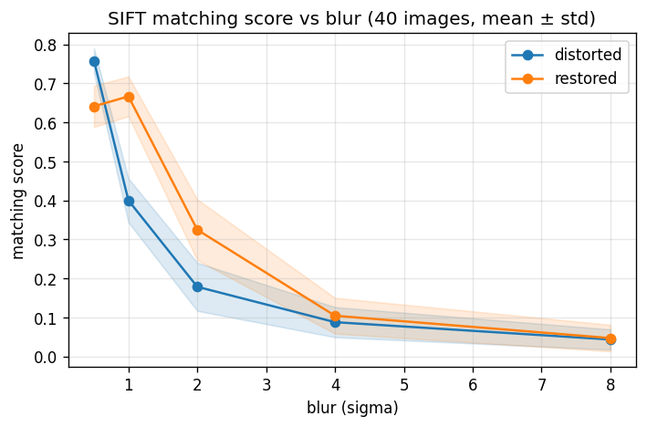
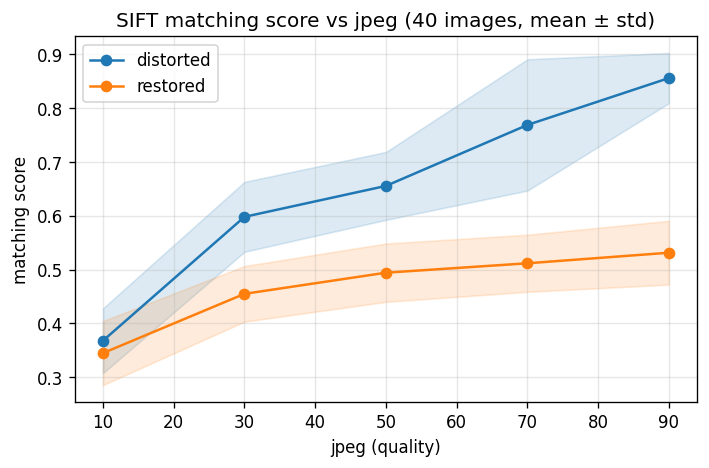
</p>

*Matching score vs. intensity — same pattern as repeatability.*

Keypoints drawn on a sample image (`scripts/keypoints_viz.py`): **blur** erases them
(290 → 12), while **noise** and **JPEG** spawn *spurious* unstable ones (290 → 362 / 331) —
which is why both repeatability and matching collapse.

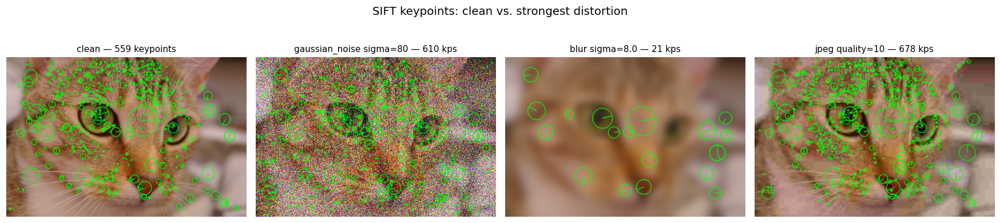

**Key finding:** the matched cleaner helps only for **blur** (deblur restores repeatability from
0.45 → 0.76 at σ=1, consistently across all 40 images). For **noise** and **JPEG**, classical
cleaners (NLM, bilateral) *hurt* SIFT — they smooth away the fine texture keypoints sit on.
Blind enhancement is not free for low-level feature tasks; it trades pixel-level fidelity for
lost structure.

### Post-hoc fairness check: is "restoration hurts / adds nothing" a dose artifact?

At this point we stopped to re-read the tables above, and noticed that our three most-quoted
negative results share a single implementation detail. Every cleaner in
[`src/enhancements/enhancements.py`](src/enhancements/enhancements.py) runs at **one fixed
strength for the entire intensity sweep** — NLM at `h=10` against noise from σ=5 to σ=80, a
16× range. The pipeline actually knows the true level — `ImageOp` in
[`src/utils/ops.py`](src/utils/ops.py) holds it to *create* the distortion — but the cleaner
never receives it, and never looks for it.

**Why this matters most at high noise.** NLM's `h` is the patch-similarity tolerance: how
different two patches may be and still get averaged. The proper dose is proportional to the
noise (the [IPOL reference](https://www.ipol.im/pub/art/2011/bcm_nlm/) we cite recommends
h ≈ 0.55–1.0·σ). A fixed `h=10` is therefore ~2× **overdosed** at σ=5 — averaging away real
texture, which is the mechanism behind the −0.22 "restoration hurts" — and ~8× **underdosed**
at σ=80, where the similarity test rejects everything and NLM barely averages at all. So
"restoration adds nothing at strong noise" (0.22 → 0.24) was measured with a cleaner that
effectively wasn't running — **in exactly the cell where fine-tuning is declared the decisive
winner (0.75)**. If the classical opponent is underdosed where the headline gap is measured,
part of that gap could be parameterization rather than method.

**Two standard ways to make it fair.** The denoising literature has names for both:

1. *Non-blind protocol* — hand the cleaner the true σ (we synthesized the noise, so we have
   it). This is the standard benchmark protocol in denoising papers. We chose **not** to run
   it as the headline: the fine-tuned model receives only pixels at evaluation, so feeding the
   true level to the cleaner answers a benchmark question, not the deployment question. It
   remains the obvious upper-bound extension.
2. *Blind protocol* — the cleaner **estimates the noise level from the image itself** and
   doses accordingly. Same pixels-only interface as the fine-tuned model: a genuinely fair,
   deployment-realistic opponent. **This is the experiment we ran.**

**The estimator, validated before use.** We use Immerkær's method (J. Immerkær, *"Fast Noise
Variance Estimation"*, Computer Vision and Image Understanding 64(2), 1996,
[doi:10.1006/cviu.1996.0060](https://doi.org/10.1006/cviu.1996.0060)): convolve with a 3×3
Laplacian-difference mask that annihilates locally-linear image structure (flat regions,
gradients, straight edges → ≈0) while passing pixel-to-pixel noise, then scale the mean
absolute response to a Gaussian σ. Implementation: `estimate_noise_sigma` in
[`src/enhancements/enhancements.py`](src/enhancements/enhancements.py). Before trusting it we
validated it on the same seeded 40-image sample used by the SIFT/SNR experiments
([`scripts/validate_noise_estimator.py`](scripts/validate_noise_estimator.py)):

| true σ | 0 | 5 | 10 | 20 | 40 | 60 | 80 |
|---|---|---|---|---|---|---|---|
| estimated σ̂ (mean ± std) | 4.1±3.6 | 6.0±3.1 | 8.6±2.6 | 14.3±2.0 | 25.5±1.7 | 35.5±1.9 | 44.0±2.1 |

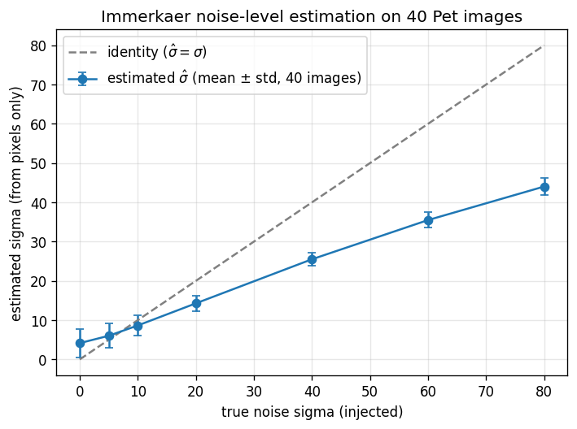

Monotone everywhere with small spread — good enough to dose with. Two honest caveats: on clean
images it reads ~4 (fine fur texture registers as noise), and at strong noise it underestimates
(44 at true 80) — largely because clipping to [0,255] genuinely truncates the injected noise,
so σ̂ tracks the *effective* noise in the saved image, which is arguably the right dose target.
The blind cleaner is then three lines (`denoise_blind`): estimate σ̂, set h = 0.8·σ̂, run NLM.
While implementing we also found and fixed a channel-order bug — OpenCV's colored NLM assumes
BGR input and we had been passing RGB — so the fixed-dose arm below is re-measured with the
corrected implementation (the §9 tables above are kept unchanged as the original record; the
differences are small).

**Results** ([`scripts/run_noise_fairness.py`](scripts/run_noise_fairness.py); same frozen
checkpoints, same val sets, noise only):

*Classification (Top-1, 300 val images):*

| σ | distorted | restored (fixed h=10) | restored (blind σ̂) | fine-tuned |
|---|---|---|---|---|
| 5 | 0.933 | 0.710 | 0.863 | 0.903 |
| 10 | 0.913 | 0.723 | 0.823 | 0.893 |
| 20 | 0.863 | 0.717 | 0.677 | 0.897 |
| 40 | 0.657 | 0.633 | 0.450 | 0.857 |
| 80 | 0.230 | 0.230 | **0.307** | **0.747** |

*Segmentation (mIoU, 300 val images):*

| σ | distorted | restored (fixed h=10) | restored (blind σ̂) | fine-tuned |
|---|---|---|---|---|
| 5 | 0.922 | 0.901 | 0.914 | 0.912 |
| 10 | 0.919 | 0.902 | 0.908 | 0.911 |
| 20 | 0.905 | 0.897 | 0.894 | 0.908 |
| 40 | 0.847 | 0.856 | 0.868 | 0.896 |
| 80 | 0.624 | 0.622 | **0.818** | 0.870 |

*SIFT repeatability (mean over 40 images):*

| σ | distorted | restored (fixed h=10) | restored (blind σ̂) |
|---|---|---|---|
| 5 | 0.77 | 0.41 | 0.67 |
| 10 | 0.66 | 0.41 | 0.53 |
| 20 | 0.53 | 0.40 | 0.36 |
| 40 | 0.38 | 0.36 | 0.24 |
| 80 | 0.25 | 0.25 | 0.12 |

<p>
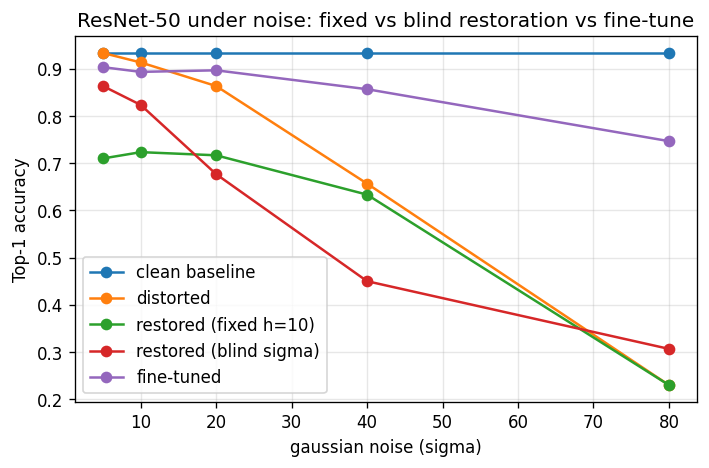
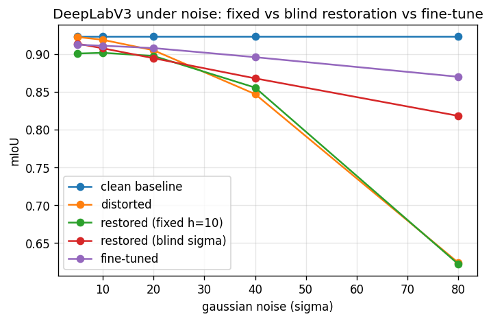
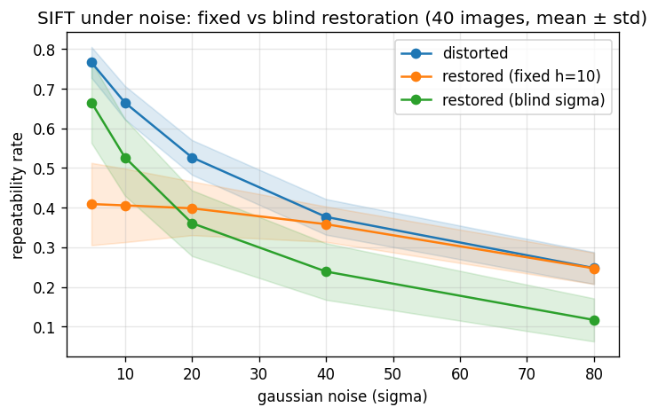
</p>

*Four-condition noise curves per task: distorted, fixed-dose, blind self-dosed, fine-tuned.*

**What the fair comparison changed — and what it didn't:**

1. **The magnitude of "restoration hurts" at mild noise was indeed a dose artifact.** At σ=5
   the damage shrinks from −0.22 (fixed) to −0.07 (blind) for classification, and from −0.35
   to −0.10 for SIFT. Overdosing was real.
2. **But the sign holds for texture-driven tasks.** Even correctly self-dosed denoising never
   beats simply feeding the frozen model the noisy image — for classification up to σ=40, and
   for SIFT at every level. Strikingly, at σ=40 the *stronger correct* dose is worse than the
   *wrong weak* one (0.450 vs 0.633): the network tolerates noise better than it tolerates
   the smoothing that removes it.
3. **For segmentation the original conclusion really was a dose artifact.** Blind restoration
   at σ=80 recovers mIoU 0.624 → **0.818** — most of the way to fine-tuning (0.870) — where
   the underdosed fixed cleaner did nothing (0.622). For shape-based dense tasks,
   correctly-dosed classical restoration is a genuine alternative to retraining.
4. **A cleaner cross-task law emerges.** The more a task depends on fine texture, the more
   denoising hurts it; the more it depends on shape, the more denoising helps: at σ=80 the
   blind cleaner buys **−0.13** repeatability for SIFT, **+0.08** Top-1 for classification,
   **+0.19** mIoU for segmentation. Same images, same cleaner — opposite outcomes.

**Fine-tune probes (same script).** Two cells the main grid never measured:

- *The price of fine-tuning:* the fine-tuned classifier drops on clean images, 0.933 → 0.903.
  Robustness was bought with 3 points of clean accuracy.
- *Held-out level σ=60* (between the trained 40 and 80): fine-tuned scores **0.817**, right on
  the line between its trained neighbors (0.857 at σ=40, 0.747 at σ=80), while the frozen
  model manages 0.427. The model learned the noise *axis*, not the training menu — the
  fine-tuning advantage generalizes at least within the trained range.

---

## 10. Discussion

**Robustness diverges with abstraction level.** Across the same distortions, fragility ranks
SIFT keypoints (most fragile) → classification → segmentation (most robust). Fine local structure
is destroyed first; region/shape labels survive longest. At noise σ=80, SIFT repeatability falls to
0.24 and ResNet-50 to 0.22 Top-1, while segmentation mIoU — though it too drops — holds at 0.62.

**Blind classical restoration is not free.** The Δ-recovery columns make this concrete: the matched
cleaner helps only for **blur** (deblur re-adds attenuated high frequencies — repeatability +0.31 at
σ=1, mean over 40 images). For **noise** and **JPEG**, NLM and bilateral filtering *smooth away*
the exact detail the downstream task relies on, so recovery is often **negative** (SIFT −0.35 at
σ=5; ResNet-50 −0.23 at σ=5). Enhancement tuned for human-visible quality is not tuned for the
algorithm consuming it.

**Restoration vs. fine-tuning — the headline result.** Fine-tuning the model on distorted data
**beats restoration decisively**, and the gap is largest exactly where restoration fails — the
strongest distortions:

| Strongest level | distorted | restored | fine-tuned |
|---|---|---|---|
| Classification, noise σ=80 | 0.22 | 0.24 | **0.75** |
| Classification, blur σ=8 | 0.13 | 0.13 | **0.59** |
| Classification, JPEG q=10 | 0.64 | 0.64 | **0.82** |
| Segmentation, noise σ=80 | 0.63 | 0.62 | **0.87** |

At mild distortion the model is already robust so all three agree; at severe distortion restoration
adds nothing while fine-tuning recovers most of the loss.

**The post-hoc fairness check refines this.** The table above uses the fixed-dose cleaners; the
blind self-calibrating protocol (§9 fairness check) shows the verdict splits by task type. For
texture-driven tasks the conclusion survives the fair fight: correctly-dosed denoising still
loses to the distorted input (classification up to σ=40, SIFT everywhere), and fine-tuning stays
decisively ahead. For shape-driven segmentation it does not: correct dosing at σ=80 recovers
0.624 → 0.818, closing most of the gap to fine-tuning (0.870) — there, the original "restoration
adds nothing" was a dose artifact. The σ=60 probe also shows the fine-tuned model interpolates to
unseen levels (0.817), at a measured cost of 3 points of clean accuracy.

**Practical takeaway.** Match the recovery method to the *consumer*. Blind classical enhancement
tuned for the human eye can *hurt* the algorithm; **adapting the model** is the more reliable lever,
especially under severe degradation — with one carve-out from the fairness check: for shape-based
dense tasks, a correctly self-dosed classical cleaner is a cheap, training-free alternative that
recovers most of the fine-tuning gain.

---

## 11. Notes from building this

A few things that came up along the way, in case they're useful to anyone repeating the experiment:

- The result that surprised us most is that denoising the input *lowers* SIFT repeatability and
  classifier accuracy at low noise. NLM produces a cleaner-looking picture but removes the micro-texture
  the algorithm keys on. We left it in rather than tuning the cleaner to look good — the negative
  number is the point.
- We expected to need Colab, but a MacBook's MPS backend trained both models fine on a ~1.5k subset,
  so everything runs locally; Colab is just the fallback.
- First version of the repeatability metric counted a clean keypoint as "repeated" if *any* distorted
  keypoint was nearby. That over-counts when noise spawns clusters of keypoints, so it now uses
  one-to-one matching. The fix lowered the numbers a few points but didn't change any conclusion.
- SIFT originally ran on a single stock photo; it now runs on 40 seeded dataset images with
  mean ± std. The averages moved a few points (e.g. denoise damage at σ=5 went from −0.48 on
  the one image to −0.35 ± spread across images) but every conclusion held — and now has a
  variance estimate behind it.
- Limitations: the aggregate DL sweeps use a 300-image val subset (the per-breed × intensity
  sweep uses 2,480 held-out images to make per-class numbers meaningful), no repeated seeds
  for the fine-tune runs, segmentation is binary (pet/background, though now reported per
  class), and only classical restorers are implemented — DL restorers (DnCNN, Restormer,
  FBCNN) are an obvious next step.
