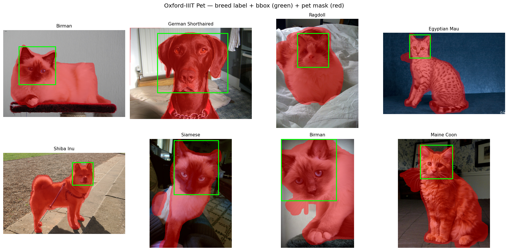
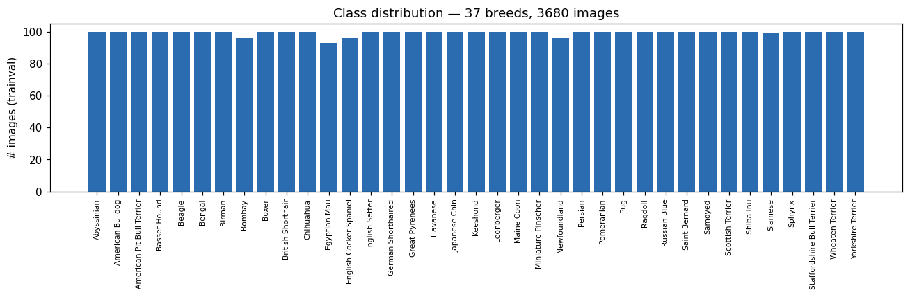

# Image-Processing Final Project — Robustness of Vision Models to Distortions

**Goal:** evaluate how robust image-processing / computer-vision algorithms and models are to
controlled image distortions, and how much we can recover with (1) image restoration and
(2) model fine-tuning.

This README doubles as the project **report**: it holds the design decisions (with references),
the experiment matrix, and the result tables, before/after grids, and degradation/recovery curves.

---

## 1. Decision table (the chosen end-to-end bundle)

| Axis | Choice | One-line justification |
|---|---|---|
| **Dataset** | [Oxford-IIIT Pet](https://www.robots.ox.ac.uk/~vgg/data/pets/) ([torchvision loader](https://pytorch.org/vision/stable/generated/torchvision.datasets.OxfordIIITPet.html)) | One small dataset with GT for **both** classification (breed label) and segmentation (trimap mask); also ships head bounding boxes; Colab-friendly. |
| **Task 1 — high-level, DL** | classification → [ResNet-50](https://arxiv.org/abs/1512.03385) ([torchvision](https://pytorch.org/vision/stable/models/resnet.html)) | Strong pretrained backbone; fine-tune to 37 breeds; metric = **Top-1 accuracy**. |
| **Task 2 — high-level, DL, dense** | segmentation → [DeepLabV3-ResNet50](https://arxiv.org/abs/1706.05587) ([torchvision](https://pytorch.org/vision/stable/models/deeplabv3.html)) | Pretrained dense model; fine-tune pet-vs-background; metric = **mIoU**. |
| **Task 3 — low-level, classical** | interest points → [SIFT](https://www.cs.ubc.ca/~lowe/papers/ijcv04.pdf) ([OpenCV](https://docs.opencv.org/4.x/da/df5/tutorial_py_sift_intro.html)) | No GT needed, CPU-only; metrics = **repeatability rate** + **matching score**. |
| **Distortion 1** | [Gaussian noise](https://en.wikipedia.org/wiki/Gaussian_noise) | Intensity axis = σ; attacks fine texture → SIFT + classifier. |
| **Distortion 2** | [Gaussian blur](https://docs.opencv.org/4.x/d4/d13/tutorial_py_filtering.html) | Intensity = kernel σ; removes high-frequency detail. |
| **Distortion 3** | [JPEG compression](https://ieeexplore.ieee.org/document/125072) | Intensity = quality factor; blocky 8×8 DCT artifacts. |
| **Metrics axes** | per **class** AND per **intensity (SNR)** | Required two-axis reporting; plus before/after grids and curves. |

**Requirement check:** 2 high-level DL tasks + 1 low-level classical task ✔ · ≥3 distortions ✔ ·
dataset with GT ✔ · ≥1 DL model ✔ · low + high level mix ✔.

---

## 2. Methods & matched enhancements (with references)

Matching rule: each distortion is paired with the cleaner designed to invert it.

| Distortion | Matched enhancement (default = classical) | Reference |
|---|---|---|
| Gaussian noise | **Denoising** — Non-Local Means (`cv2.fastNlMeansDenoisingColored`) | [Buades et al. 2005 / IPOL](https://www.ipol.im/pub/art/2011/bcm_nlm/) |
| Blur | **Deblurring** — unsharp masking (Wiener / DL optional) | [Unsharp masking](https://en.wikipedia.org/wiki/Unsharp_masking) |
| JPEG | **Artifact removal** — bilateral filter (DL optional) | [Tomasi & Manduchi 1998](https://users.cs.duke.edu/~tomasi/papers/tomasi/tomasiIccv98.pdf) |

**Improvement per DL task:** (1) restoration pre-processing, (2) fine-tuning on distorted data.
SIFT gets restoration only — it is a fixed algorithm with no weights to train.

### The math/why in one sentence each
- **Gaussian noise:** add `N(0, σ²)` per pixel; raising σ lowers SNR and buries fine texture.
- **Blur:** convolve with a Gaussian kernel of width σ; larger σ suppresses high frequencies.
- **JPEG:** quantize 8×8 DCT blocks; lower quality factor = coarser quantization = blocky artifacts.
- **Denoising (NLM):** average pixels with similar neighborhoods to cancel zero-mean noise.
- **Deblurring (unsharp):** add back a scaled high-pass (image − blur) to boost lost high frequencies.
- **JPEG removal (bilateral):** edge-aware smoothing to suppress block boundaries while keeping edges.
- **ResNet-50:** deep residual CNN; skip connections let very deep nets train stably.
- **DeepLabV3:** atrous (dilated) convolutions + ASPP to segment at multiple scales.
- **SIFT:** scale-space DoG keypoints with gradient-orientation descriptors invariant to scale/rotation.

---

## 3. Dataset & EDA

Oxford-IIIT Pet, `trainval` split, downloaded via torchvision (`python -c "from src.data.pets import load_pets_classification; load_pets_classification(download=True)"`).

| Property | Value |
|---|---|
| Images (trainval) | 3,680 |
| Breeds (classes) | 37 (cats + dogs) |
| Images per class | min 93 · max 100 · mean 99.5 (well balanced) |
| Image size (sampled) | width 140–650 (median 500) · height 134–566 (median 375) |
| Ground truth | breed label · head bounding box · trimap segmentation mask |

**Annotated samples** (breed title · green head bbox · red pet mask overlay) — generated by
`scripts/eda.py`:



**Class distribution** (37 breeds, near-uniform ~100 images each):



> Note: Oxford-IIIT Pet bounding boxes annotate the **head** only, so the green box is small
> relative to the full animal that the segmentation mask covers.

---

## 4. Experiment matrix

For every (task × distortion) we measure:

1. **Baseline** — clean images.
2. **Distorted** — degradation across the full intensity sweep.
3. **Improvement (1) Restoration** — distorted → matched cleaner → model.
4. **Improvement (2) Fine-tune** — re-train the DL model (classification, segmentation) on distorted data.

Outputs: result tables (per class + per intensity), degradation/recovery **curves**, and
**before/after** image grids.

---

## 5. Compute & GPU flags

- **CPU (local):** SIFT, all distortions/enhancements, EDA, baseline inference.
- **GPU:** the two fine-tunes (ResNet-50, DeepLabV3). Confirmed to run locally on **Apple MPS**;
  free **Colab T4** is the documented fallback (`notebooks/colab_finetune.ipynb`, runtime → T4).

---

## 6. Repository structure

```
.
├── configs/            # experiment config (paths, intensity sweeps, subset sizes)
├── src/
│   ├── data/           # Oxford-IIIT Pet loaders + distortion-injecting datasets
│   ├── distortions/    # gaussian noise / blur / jpeg + intensity sweeps
│   ├── enhancements/   # denoise / deblur / de-jpeg (classical + optional DL)
│   ├── tasks/          # classification (ResNet-50), segmentation (DeepLabV3), keypoints (SIFT)
│   ├── metrics/        # top-1, mIoU, repeatability, matching score
│   └── utils/          # viz (grids/curves), picklable image-op
├── scripts/            # eda.py + run_{keypoints,classification,segmentation}.py + smoke_test.py
├── notebooks/          # Colab fine-tuning
├── assets/             # README figures (tracked)
└── results/            # generated tables / figures (git-ignored)
```

---

## 7. Setup

```bash
python -m venv .venv && source .venv/bin/activate
pip install -r requirements.txt
python scripts/smoke_test.py          # sanity check (no GPU/data needed)
python scripts/eda.py                 # dataset stats + annotated grid
python scripts/run_keypoints.py       # Task 3 (CPU)
python scripts/run_classification.py  # Task 1 (MPS/GPU)
python scripts/run_segmentation.py    # Task 2 (MPS/GPU)
```

---

## 8. Progress vs. course weekly plan

| Week | Deliverable | Status |
|---|---|---|
| 1 | Open Git repo + register | ✔ repo · *register in course table (manual)* |
| 2 | Dataset/distortions/tasks table with links | ✔ §1 |
| 3 | Methods/enhancements table with links | ✔ §2 |
| 4 | Download + EDA + annotated grid | ✔ §3, `scripts/eda.py` |
| 5–6 | Run on clean data + measure (per class) | ✔ Task 3 · ✔ Task 1 baseline (Top-1 = 0.93) · ◻ Task 2 baseline |
| 7 | Apply distortions + before/after | ✔ `src/distortions`, grids |
| 8 | Measure degradation | ✔ Task 3 · ✔ Task 1 · ◻ Task 2 |
| 9 | Apply enhancements + measure | ✔ Task 3 · ✔ Task 1 · ◻ Task 2 |
| 10–11 | Fine-tune + measure | ◻ in progress (improvement #2) |
| 12 | Polish README (de-AI pass) | ◻ scheduled last |
| 13 | PPT/PDF + final repo review | ◻ |

---

## 9. Results

_Filled as experiments run. Task 3 (keypoints) and Task 1 (classification) sweeps complete;
see `results/` for the generated curves, grids and CSVs._
